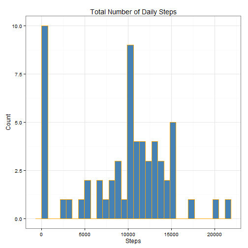

## Loading and preprocessing the data

Let's start by reading the *activity* dataset found in the Github repository.


```r
unzip("activity.zip")
df <- read.csv("./activity.csv", header=T)
str(df)
```

```
## 'data.frame':	17568 obs. of  3 variables:
##  $ steps   : int  NA NA NA NA NA NA NA NA NA NA ...
##  $ date    : Factor w/ 61 levels "2012-10-01","2012-10-02",..: 1 1 1 1 1 1 1 1 1 1 ...
##  $ interval: int  0 5 10 15 20 25 30 35 40 45 ...
```

The `date` variable is a character string, but we may want to transform it into a Datetime format. Let's use the `as.Date()` R function.


```r
df$date <- as.Date(df$date, format="%Y-%m-%d", tz="UTC")
class(df$date)
```

```
## [1] "Date"
```

## What is mean total number of steps taken per day?

First of all, in order to calculate the total number of steps per day, we need to ignore the missing values in the dataset. The variable `steps` needs to be summarized by day prior to do any calculation on it. We can do all these steps at once by taking advantage of the `dplyr` package by Hadley Wickham.


```r
library(dplyr)
df.tot <- df %>%
        group_by(date) %>%
        summarise(steps.sum = sum(steps, na.rm = TRUE))
head(df.tot)
```

```
## Source: local data frame [6 x 2]
## 
##         date steps.sum
## 1 2012-10-01         0
## 2 2012-10-02       126
## 3 2012-10-03     11352
## 4 2012-10-04     12116
## 5 2012-10-05     13294
## 6 2012-10-06     15420
```

Now that we have total steps per day, let's make a histogram of the total number of steps taken each day. For this, I am going to use the `ggplot2` package (by Hadley wickham...of course!).

```r
library(ggplot2)
g <- ggplot(df.tot, aes(x = steps.sum))
g + geom_histogram(fill='orange', color='steelblue') +
#if you want to plot the relative frequency instead of absolute counts, use the following line as well
#stat_bin(aes(y=..count../sum(..count..))) +
    labs(title ="Total Number of Daily Steps", x = "Steps", y = "Count") +
    theme_bw()        
```

 

Finally, let's calculate and report the mean and median of the total number of steps taken per day.

```r
mean <- round(mean(df.tot$steps.sum), 2)
median <- median(df.tot$steps.sum)
```

**RESULT:** The mean number of total steps taken per day is **9354.23**, while the median is **10395**.


## What is the average daily activity pattern?

Let's start by calculating the average number of steps across all days for each 5-minute interval.

```r
df.mod <- df %>%
        group_by(interval) %>%
        summarise(steps.avg = mean(steps, na.rm=T))
```

Now, let's make a time series plot (i.e. `type = "l"`) of the 5-minute interval (x-axis) and the average number of steps taken, averaged across all days (y-axis)

```r
g <- ggplot(df.mod, aes(x = interval, y = steps.avg))
g + geom_line(color='red', size=1) +
    labs(title ="Average Steps Taken By Daily Interval", x = "Interval", y = "Average Steps") +
    theme_bw() 
```

 

Which 5-minute interval, on average across all the days in the dataset, contains the maximum number of steps?

```r
steps.max <- df.mod$interval[which.max(df.mod$steps.avg)]
```

**RESULT:** The 5-minute interval that on average contains the maximum number of steps is **835**, which corresponds to 8.35 AM

## Imputing missing values

Note that there are a number of days/intervals where there are missing values (coded as NA). The presence of missing days may introduce bias into some calculations or summaries of the data.

Calculate and report the total number of missing values in the dataset (i.e. the total number of rows with NAs)

```r
missing.tot <- sum(is.na(df$steps))
```

The total number of missing values in the dataset is **2304**.

In order to fill in all of the missing values in the dataset, we will use the daily mean. Let's first calculate daily means, and then replace those values into the original dataset.

```r
df.mean <- df %>%
        group_by(date) %>%
        mutate(steps = replace(steps, is.na(steps), mean(steps, na.rm=TRUE)))
```

Let's now recalculate the total number of steps per day and redraw a histogram of the total number of steps taken each day. 

```r
df.mean.tot <- df.mean %>%
        group_by(date) %>%
        summarise(steps.sum = sum(steps, na.rm=T))

#Make the new histogram
g <- ggplot(df.mean.tot, aes(x = steps.sum))
g + geom_histogram(fill='steelblue', color='orange') +
#if you want to plot the relative frequency instead of absolute counts, use the following line as well
#stat_bin(aes(y=..count../sum(..count..))) +
    labs(title ="Total Number of Daily Steps", x = "Steps", y = "Count") +
    theme_bw() 
```

 

Calculate and report the mean and median total number of steps taken per day. Do these values differ from the estimates from the first part of the assignment? What is the impact of imputing missing data on the estimates of the total daily number of steps?

```r
mean.new <- round(mean(df.mean.tot$steps.sum), 2)
median.new <- median(df.mean.tot$steps.sum)
```

**RESULT:** The mean number of total steps taken per day is **9354.23**, while the median is **1.0395 &times; 10<sup>4</sup>**. Both estimates do not differ from the ones calculated on the data with missing values, thus the imputation method chosen did not seem to have an effect.


## Are there differences in activity patterns between weekdays and weekends?

Create a new factor variable in the dataset with two levels ‚<U+0080><U+0093> ‚<U+0080><U+009C>weekday‚<U+0080>ù and ‚<U+0080><U+009C>weekend‚<U+0080>ù indicating whether a given date is a weekday or weekend day.


```r
df.mean <- df.mean %>%
           mutate(fDay = factor(ifelse(weekdays(date) %in% c("Saturday", "Sunday"), "weekend", "weekday"), levels = c("weekday", "weekend"))) %>%
           group_by(interval, fDay) %>%
           summarise(steps.avg = mean(steps, na.rm=T))
```

Let's now make a panel plot containing a time series plot (i.e. type = "l") of the 5-minute interval (x-axis) and the average number of steps taken, averaged across all weekday days or weekend days (y-axis).

```r
g <- ggplot(df.mean, aes(x = interval, y = steps.avg))
g + geom_line(color='red', size=1) +
    facet_wrap( ~ fDay, ncol=1) +
    labs(title ="Average Steps Taken By Daily Interval", x = "Interval", y = "Average Steps") +
    theme_bw() 
```

 


